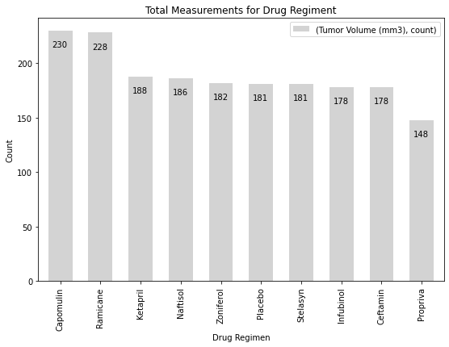

# matplotlib-challenge
Matplotlib Homework
  
  
  

# Observations
## 1. Summary statistics table:

    1.1.  Best results based on min max and mean Tumor volumes were produced by Capomulin, Ramicane, Infubinol, and Ceftamin treatment regiments
    1.2. Analysis of Mean, Median , Std  indicate that data for these four drugs is least spread and centered around mean (logically - smaller tumors). Lower SEM compare to other drugs indicating better sample representaion of population
    
   **_Tumor Volume Statistics table_**
|Drug Regimen|count|	max|	min|	mean|	median|	var|	std|	sem|
|---|---|---|---|---|---|---|---|---|						
Ramicane	|228	|47.622816|	22.050126|	40.216745|	40.673236|	23.486704|	4.846308|	0.320955|
Capomulin|	230	|48.158209|	23.343598|	40.675741|	41.557809|	24.947764|	4.994774|	0.329346|
Ceftamin|	178|	68.923185|	45.000000|	52.591172|	51.776157|	39.290177|	6.268188|	0.469821|
Infubinol|	178	|72.226731|	36.321346|	52.884795|	51.820584|	43.128684|	6.567243|	0.492236|
Zoniferol|	182	|73.324432|	45.000000|	53.236507|	51.818479|	48.533355|	6.966589|	0.516398|
Propriva|	148	|72.455421|	45.000000|	52.320930|	50.446266|	43.852013|	6.622085|	0.544332|
Stelasyn|	181|	75.123690|	45.000000|	54.233149|	52.431737|	59.450562|	7.710419|	0.573111|
Placebo|	181|	73.212939|	45.000000|	54.033581|	52.288934|	61.168083|	7.821003|	0.581331|
Naftisol|	186|	76.668817|	45.000000|	54.331565|	52.509285	|66.173479|	8.134708|	0.596466|
Ketapril|	188|	78.567014|	45.000000|	55.235638|	53.698743|	68.553577|	8.279709|	0.603860|

## 2. Bar charts  
    bar charts indicate that more data point were observed in Capomulin & Ramicane, least in Propriva regiment
#
#
#
## 3. Pie charts  
 
    pie charts of mice sex indicate almost equal distribution.

## 5. Box & Wiskers plots 

    5.1. Box & Wiskers plots indicate already noticed earlier tight distribution.There is only one outlier found for all four drugs - in Infubinol data set. 
    5.2. clearly show Better performance for Capomulin & Ramicane compare to Infubinol, and Ceftamin.

## 6. Line charts

    6.1. Graphical presentation of Capomulin Treatment performance clearly shows centering around mean.
    6.2. Dead or cured mice ? w150,r157,f966,j246 - we need to look further into this - as it would skew data a bit

## 7. Scatter plot

    7.1. Shows ver strong positive correlation between weight of the mouse and average tumor volume.
    7.2  p value indicates probability of that there is no correlation is 0.000013% (less than 6 sigma ) , so we can reject null hypothesis.

